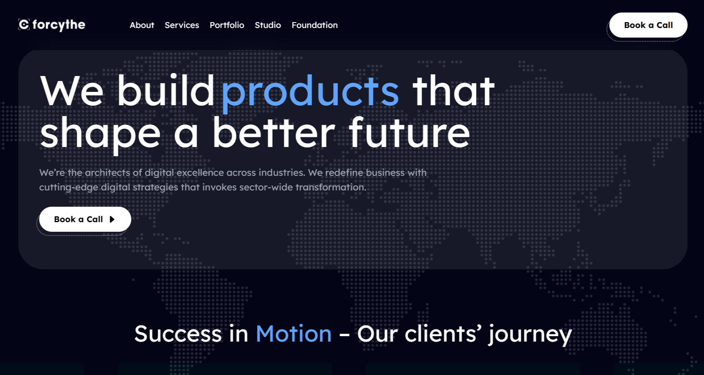

<div align="center">
  <br />
    
  <br />

  <div>
    
    
  </div>

  <h3 align="center">Forcythe clone</h3>

   <div align="center">
   Recreated the landing page of one of the largest digital agency in Nigeria
    </div>
</div>

## 📋 <a name="table">Table of Contents</a>

1. ⚙️ [Tech Stack](#tech-stack)
2. 🔋 [Features](#features)
3. 🤸 [Quick Start](#quick-start)

## <a name="tech-stack">⚙️ Tech Stack</a>

-   React.js
-   Tailwind CSS

## <a name="features">🔋 Features</a>

-   Modern UI/UX design

## <a name="quick-start">🤸 Quick Start</a>

Follow these steps to set up the project locally on your machine.

**Prerequisites**

Make sure you have the following installed on your machine:

-   [Git](https://git-scm.com/)
-   [Node.js](https://nodejs.org/en)
-   [npm](https://www.npmjs.com/) (Node Package Manager)

**Cloning the Repository**

```bash
git clone https://github.com/adrianhajdin/award-winning-website.git
cd award-winning-website
```

**Installation**

Install the project dependencies using npm:

```bash
npm install
```

**Running the Project**

```bash
npm run dev
```

Open [http://localhost:5173](http://localhost:5173) in your browser to view the project.
